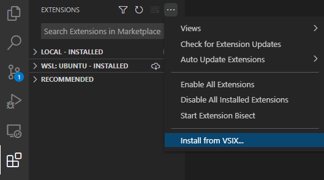
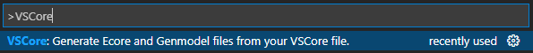

# VSCore

**Table of Contents**

- [Introduction](#introduction)
- [Installing and running the extension](#installing-and-running-the-extension)
- [Language Syntax](#language-syntax)
- [Project Structure](#project-structure)

## Introduction

VSCore is a domain-specific language (DSL) that aims to serve as an alternative syntax to Ecore model files. The verbose XML syntax of `.ecore` files means that they are typically edited through some Eclipse plugin user interface. The goal of VSCore is to allow developers to write their models in code rather than through a plugin UI, with a syntax much akin to Java, which should be familiar to most users of Ecore.

To make the developer experience as smooth as possible, this project provides an extension for VSCode to enable editing of `.vscore` files with syntax highlighting and feedback. The extension also provides a command line interface (CLI) for generating `.ecore` and `.genmodel` files from `.vscore` files. The generated files can then be used for all traditional applications of Ecore.

VSCore uses the [Langium framework](https://github.com/langium/langium).

## Installing and running the extension

**Installing the extension:**

- Download the `vs-core-1.0.0.vsix` file (located at the root of this git repository)
- Open VSCode and navigate to the Extension pane. Click the ... menu, then the `Install from VSIX...` option, as shown below.



- Select the downloaded `vs-core-1.0.0.vsix` file. This will install the VSCore extension in your VSCode.

**Using the extension:**

- Create a file ending in `.vscore`. As you type, the extension will provide syntax highlighting and feedback ([Language Syntax](#language-syntax) below provides a guide to the syntax).
- Once you have created the `.vscore` file, you can generate `.ecore` and `.genmodel` files from it by entering the VSCode Command Pallette (`Ctrl + Shift + P` by default), and searching for VSCore. The VSCore generate command should show up as below.



- The generated files will appear in a folder called `generated` in the same directory as the `.vscore` file.

## Language Syntax

The following section describes the various language keywords of VSCore, providing examples along the way.

There are three possible top-level declarations in VSCore: `Model`, `enum`, `class` and `interface`.

### Model

`.vscore` files start by defining the model name and the corresponding `nsURI`.

```
Model ExampleModel;
nsUri "ntnu.vscore.model";
```

### Enums

Enums simply contain a set of unique names. VSCore automatically assigns integer values to the enum values, in ascending order, and assigns literals equal to the lower-case of the provided names. In the below example, the generated Ecore enum of `Spring`, `Summer`, `Fall` and `Winter` would have corresponding values `0`, `1`, `2` and `3`, and corresponding literals `"spring"`, `"summer"`, `"fall"` and `"winter"`. In order to keep the syntax simple, VSCore does not allow customization of values and literals.

```
enum Season {
    Spring, Summer, Fall, Winter
}
```

### Classes and interfaces

Classes and interfaces are functionally almost identical. They contain a set of fields, which can either be just data (currently `int`, `float`, `String`), or references to other classes, interfaces or enums.

```
class Semester {
    int year;
    Season season;
}
```

References are either just plain references, marked with the `refers` keyword, or container/containment references, marked with `Container<>` or `Containment<>`.

```
class Course {
	refers Semester semester;
	Container<University> university;
}
```

Fields have a lower bound of 0 and an upper bound of 1 by default. This can be modified by:

- The `required` keyword, which sets the lower bound to 1.
- Adding `[]` behind the type, which sets the upper bound to -1 (unbounded).
  - The lower and upper bounds can be exactly defined, separated by comma, as such: `[LOWERBOUND, UPPERBOUND]`.

Furthermore, the Ecore opposite relation of a reference can be defined with the `opposite` keyword.

```
class StudyProgram {
    required String name;
    refers Course[] courses;
    refers Semester[2, 10] semesters;
    refers University university opposite programs;
}
```

Classes implement interfaces by using the `implements` keyword.

```
interface CourseContainer {
    refers Course[] courses;
}

class ElectiveCourseGroup implements CourseContainer {
    int requiredFromGroup;
}
```

## Project Structure

- `src/extension.ts` launches the extension by starting a language client and server, that watch `.vscore` files.
- `src/language-server` contains the grammar and validation for the VSCore language.
  - `main.ts` starts the language server with VSCore's defined services.
  - `vs-core-module.ts` defines VSCore's custom services - essentially only the validator - and adds them to Langium's default services.
  - `vs-core-validator.ts` defines the custom validators for the VSCore language.
  - `vs-core.langium` defines the grammar of VSCore: the tokens allowed by the language.
- `src/cli` contains the command line interface for VSCore - essentially the interface for generating `.ecore` and `.genmodel` files from `.vscore` files.
  - `generator.ts` provides the logic for generating `.ecore` and `.genmodel` files.
  - `index.ts` connects that generator logic to the CLI.
  - `cli-util.ts` provides some utility functions for the CLI.
- `language-configuration.json` defines the syntax of comments and surrounding pairs, for editing VSCore files.
- `syntaxes/vs-core.tmLanguage.json` declares the type of syntax highlighting to be used when editing VSCore files in VSCode.
- `example` contains a couple example `.vscore` files.
